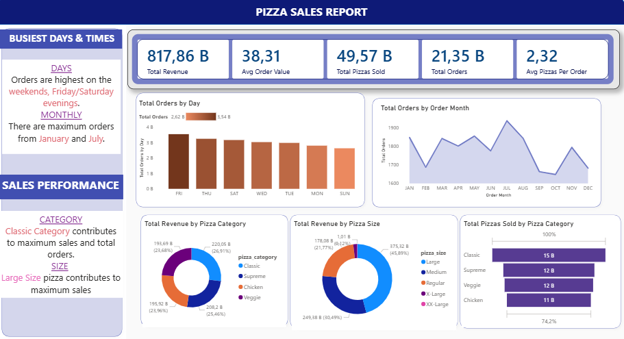
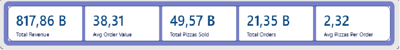
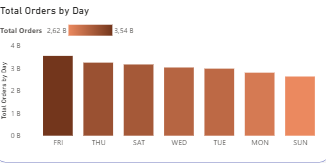

# 🍕 Pizza Sales Analysis (SQL + Power BI)

This project analyzes pizza sales data using SQL and visualizes key business insights through an interactive Power BI dashboard.

It demonstrates the full workflow of data analysis — from raw data querying to insight extraction and dashboard presentation.

---

## 🚀 Tools & Technologies

* SQL (MySQL)
* Power BI
* Data Analysis & Visualization

---

## 📊 Project Overview

The goal of this project is to explore pizza sales performance and uncover meaningful business insights.

The analysis focuses on:

* Revenue and order-based KPIs
* Daily and monthly sales trends
* Customer ordering behavior
* Product performance (best & worst sellers)
* Sales distribution by category and size

---

## 📈 Key KPIs

* Total Revenue
* Total Orders
* Average Order Value
* Total Pizzas Sold
* Average Pizzas per Order

---

## 📂 Project Structure

```
pizza-sales-sql-powerbi/
│
├─ queries/
│   ├─ q1_kpis.sql
│   └─ q2_analysis.sql
│
├─ dashboard/
│   ├─ pizza_sales_dashboard.pbix
│   └─ screenshots/
│       ├─ dashboard_overview.png
│       ├─ kpi_cards.png
│       └─ daily_orders.png
│
└─ README.md
```

---

## 🖼️ Dashboard Preview

### 🔹 Full Dashboard



### 🔹 KPI Cards



### 🔹 Daily Orders Trend



---

## 🔍 Key Insights

* Sales peak towards the end of the week, especially on Fridays and weekends
* Certain months show higher demand, indicating seasonal trends
* Classic category contributes significantly to total revenue
* Larger pizza sizes generate higher revenue share
* Peak ordering hours occur during lunch and evening periods

---

## 🧠 What This Project Demonstrates

* Writing structured and meaningful SQL queries
* Translating raw data into business insights
* Designing clean and readable dashboards in Power BI
* Understanding customer behavior and sales dynamics

---

## 📌 Notes

This project was created as part of a data analysis portfolio to showcase practical SQL and Power BI skills.

---

